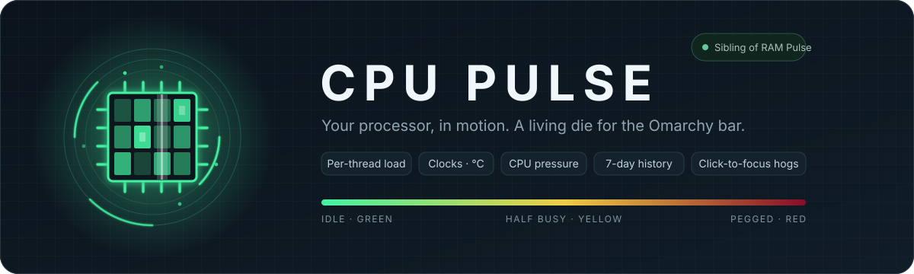
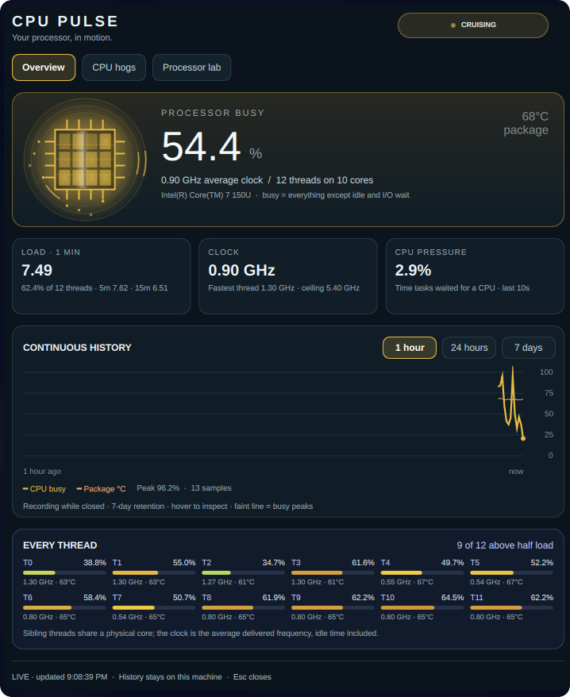
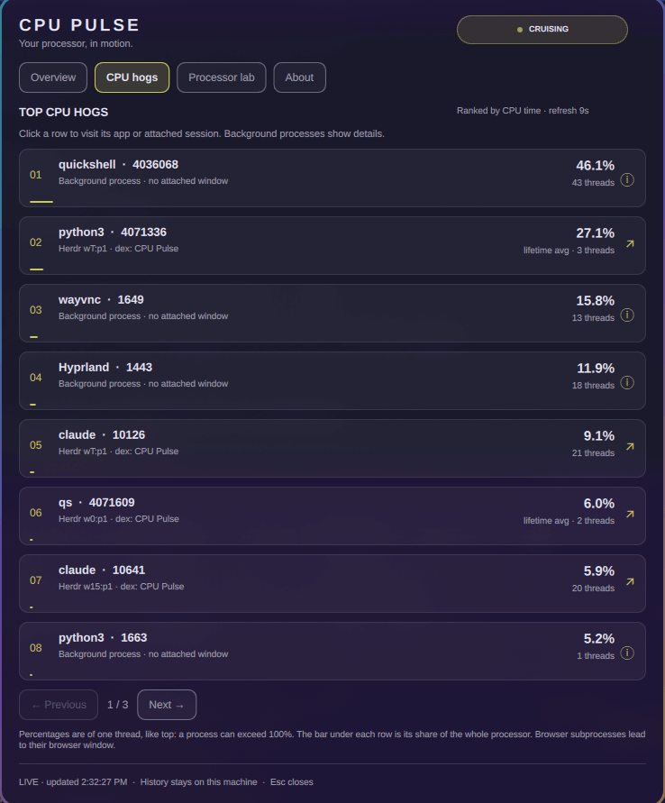
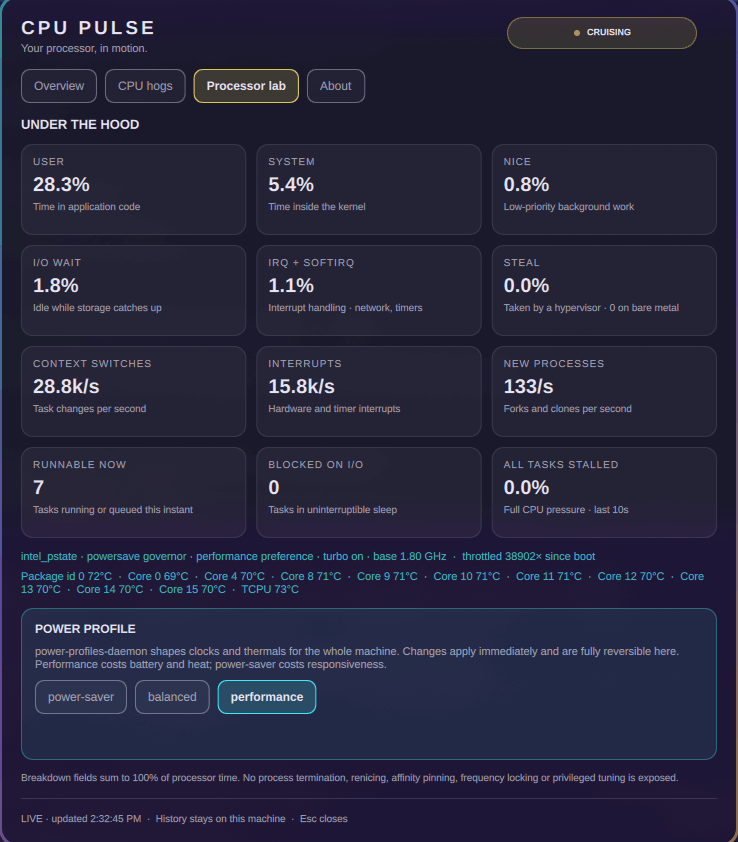
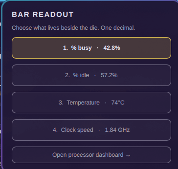
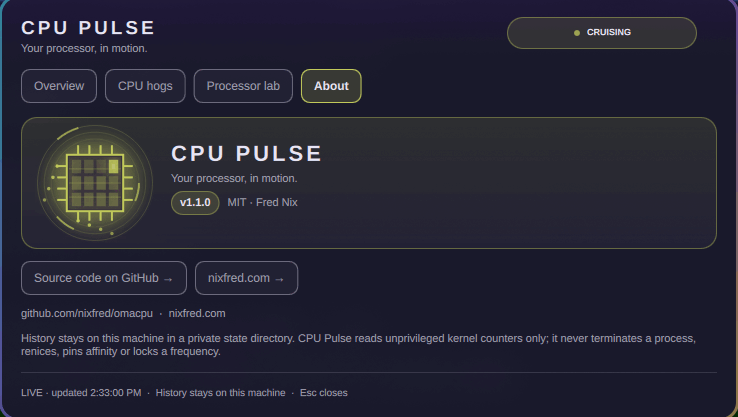

<p align="center">
  
</p>

<p align="center">
  <a href="#install"></a>
  <a href="LICENSE"></a>
  <a href="https://github.com/nixfred/ram.plugin.omarchy"></a>
  
</p>

# CPU Pulse

An animated, glowing processor die for the Omarchy top bar. Green with idle headroom → yellow at 50% busy → dark red when the processor is pegged. Every core is a cell on the die that brightens with its own load, and a clock beam sweeps faster as load rises.

<p align="center">
  
  <br>
  <sub>RAM Pulse on the left, CPU Pulse on the right. Same chip, same colour language.</sub>
</p>

Left-click opens the dashboard. Right-click offers four saved readouts: percentage busy, percentage idle, package temperature, average clock. All readouts use one decimal and explicit units.

CPU Pulse is the sibling of [RAM Pulse](https://github.com/nixfred/ram.plugin.omarchy): same chip, same colours, same dashboard layout, so the two sit together on the bar.

## The dashboard

<table>
  <tr>
    <td width="50%" valign="top">
      
    </td>
    <td width="50%" valign="top">
      
    </td>
  </tr>
  <tr>
    <td valign="top"><b>Overview.</b> Hero die with per-thread cells, busy percentage, package temperature, average and peak clock, load average against thread count, CPU pressure, 1-hour / 24-hour / 7-day history, and a bar per logical CPU with its clock and core temperature.</td>
    <td valign="top"><b>CPU hogs.</b> Top 24 processes by CPU time, eight per page, with thread counts. Click a row to focus its existing window or attached Herdr / tmux pane. Background processes report details instead.</td>
  </tr>
  <tr>
    <td width="50%" valign="top">
      
    </td>
    <td width="50%" valign="top">
      
    </td>
  </tr>
  <tr>
    <td valign="top"><b>Processor lab.</b> Full time breakdown (user, system, nice, I/O wait, IRQ, steal), context switches, interrupts, fork rate, runnable and blocked tasks, full CPU pressure, frequency driver and governor, turbo state, throttle count, every CPU temperature sensor, and a power profile card.</td>
    <td valign="top"><b>Readout picker.</b> Right-click the chip to choose what lives beside it. Keys 1–4 pick a mode; the choice is saved to your bar layout.</td>
  </tr>
  <tr>
    <td colspan="2" valign="top">
      
    </td>
  </tr>
  <tr>
    <td colspan="2" valign="top"><b>About.</b> Which build you are running, plus where it came from: the version read straight from <code>manifest.json</code>, the licence, and buttons to the source repository and to nixfred.com. Both addresses are printed in full underneath for when no browser is on hand.</td>
  </tr>
</table>

## What it does

- Animated die with per-thread cells and orbiting charge, busy percentage, average and peak clock, load average against thread count, and CPU pressure (PSI).
- Continuous 1-hour, 24-hour and 7-day history of busy percentage and package temperature, with the per-bucket busy peak as a faint envelope and hover readings. Missing history is left blank; shutdowns and recording gaps break the trace.
- Every thread: load bar, delivered clock and core temperature for each logical CPU.
- Top 24 processes by CPU time. Exact Boomux terminal titles can resolve an existing terminal too. Browser children focus their browser window, not an individual tab.
- Power profile switching through `powerprofilesctl` (power-saver, balanced, performance). This goes through power-profiles-daemon and polkit as the session user and is immediately reversible from the same card.
- Follows the active Omarchy theme. Panel, cards, borders, text and buttons resolve from the theme's popup surface and control states, and the die and history traces take the theme's own red, yellow and green.

There are no process termination, renice, affinity, frequency locking, or privileged tuning actions. Processes and window identities are revalidated on every focus click. Session routing uses argument arrays and validated IDs, never interpolated shell commands. Profile names are checked against a fixed list. No process command lines or credentials are saved.

## Install

Requires an existing Omarchy Quickshell desktop, Python 3, systemd user services and Hyprland. No additional Python packages. `power-profiles-daemon` is optional; without it the profile card is inert.

```sh
git clone https://github.com/nixfred/omacpu.git
cd omacpu
python3 install.py
```

Installs under `~/.config/omarchy/plugins/nixfred.cpu-pulse`, appends to the far-right bar, and enables `cpu-pulse.service` for the graphical session. Existing files and bar layout are backed up under `~/.local/state/omarchy/backups/cpu-pulse-TIMESTAMP/`.

The recorder runs independently of the shell/popup: metrics every 3 seconds, processes every 9 seconds, history every 15 seconds. SQLite retains seven days (up to 40,320 samples), downsampled to ~240 points per displayed range; per-bucket peaks are retained. State is private (`0700` directory / `0600` files) in `$XDG_STATE_HOME/cpu-pulse` or `~/.local/state/cpu-pulse`. History stores aggregate metrics only. The latest snapshot contains process names/PIDs/window titles and is replaced, not logged. Closed panels stop their large animations.

## Controls and diagnosis

```sh
omarchy-shell nixfred.cpu-pulse open
omarchy-shell nixfred.cpu-pulse modes
omarchy-shell nixfred.cpu-pulse status
systemctl --user status cpu-pulse.service
journalctl --user -u cpu-pulse.service
python3 cpu_pulse.py snapshot          # one-shot JSON, no daemon needed
python3 -m unittest discover -s tests -v
node tests/test_model.cjs
omarchy plugin validate .
```

Left/right arrows change dashboard tabs (Overview, CPU hogs, Processor lab, About). Escape closes. Keys 1–4 select modes in the right-click picker. Inline bar setting `animated: false` disables die animations.

Disable with `omarchy plugin disable nixfred.cpu-pulse` and `systemctl --user disable --now cpu-pulse.service`. This stops only this plugin's telemetry service; historical data stays available. Restore the timestamped `shell.json` backup only if you also intend to restore that earlier layout.

## Theming

Every colour resolves from the active Omarchy theme, and a theme switch is picked up live. Chrome comes from the shell's own roles: the panel sits directly on the themed popup surface, text is the popup text role at varying strength, and buttons use the shell control-state fills, so a theme that tunes hover or selection tunes this panel with it.

The load ramp is data rather than decoration, so it is handled separately. The shell surfaces only foreground, background, accent, urgent and muted, so the green and yellow the die needs are read from the theme's own `colors.toml`, by name or from the `color1` / `color2` / `color3` terminal slots.

Half the themes on a typical machine ship the right three hues at the wrong three saturations, so each stop is first lifted: it keeps the hue the theme chose and is raised to a readable chroma, with a deliberately wide lightness band that rescues a stop too dark or too pale to see without second-guessing a theme that picked a bright red on purpose. Only a stop at genuinely zero chroma has no hue to preserve and borrows the built-in one: of the 40 installed themes only `vantablack` and `white` score exactly 0.000 saturation and the next lowest is 0.041, so the hue floor sits just above zero. A higher floor silently rotates a faint but real hue onto the built-in one. Stops already above the chroma floor pass through untouched.

Only then are the three measured against each other, as a weighted RGB distance with a floor of 80. Lifting first matters: `2-haxorz` scores 59 raw and was rejected outright, yet its three hues sit 14, 85 and 178 degrees apart and only its chroma was missing. Measured after lifting it passes, and the die follows the theme instead of falling back. What still fails is genuinely one colour rather than three: `blue-red-4k-warm` scores 2 because its yellow `#e99b8c` and green `#ea9b8c` differ by a single step of red, and no amount of saturation pulls those apart. Of the 40 themes installed here, 36 now use their own palette and 4 keep the built-in ramp.

## Accounting

Busy is everything in `/proc/stat` except `idle` and `iowait`, the same definition `top` uses. Guest time is already inside user time and is not counted twice. Per-process percentages are of one thread, so a multi-threaded process can exceed 100%; the bar beneath each row shows its share of the whole processor. A process seen for the first time shows its lifetime average until the next 9-second sample.

The clock is `scaling_cur_freq` averaged across threads. On `intel_pstate` and similar drivers this is the delivered frequency including idle time, so a mostly idle thread reads low even when its bursts run at turbo. The ceiling is `cpuinfo_max_freq`.

Temperature prefers the `coretemp` package sensor, then the `x86_pkg_temp`, `TCPU` or SoC thermal zone. Core temperatures map through `topology/core_id`, so sibling threads share one reading. Package power is shown only when RAPL energy counters are readable without privilege, which most distributions do not allow.

References: [Linux /proc/stat](https://docs.kernel.org/filesystems/proc.html), [PSI](https://docs.kernel.org/accounting/psi.html), [cpufreq sysfs](https://docs.kernel.org/admin-guide/pm/cpufreq.html), [intel_pstate](https://docs.kernel.org/admin-guide/pm/intel_pstate.html), [power-profiles-daemon](https://gitlab.freedesktop.org/upower/power-profiles-daemon).

## Layout

| File | Role |
|---|---|
| `Panel.qml` | Bar widget, dashboard, readout picker, IPC handler |
| `CpuChip.qml` | The animated die (compact on the bar, large in the hero card) |
| `HistoryGraph.qml` | Busy / temperature history with peak envelope and hover |
| `Model.js` | Colour ramp, formatting, readout modes |
| `cpu_pulse.py` | Telemetry daemon, SQLite history, focus and profile actions |
| `install.py` | Copies the plugin, enables the service, appends to the bar with backups |
| `tests/` | Python unit tests and a Node check of the model helpers |

## License

MIT. See [LICENSE](LICENSE).
